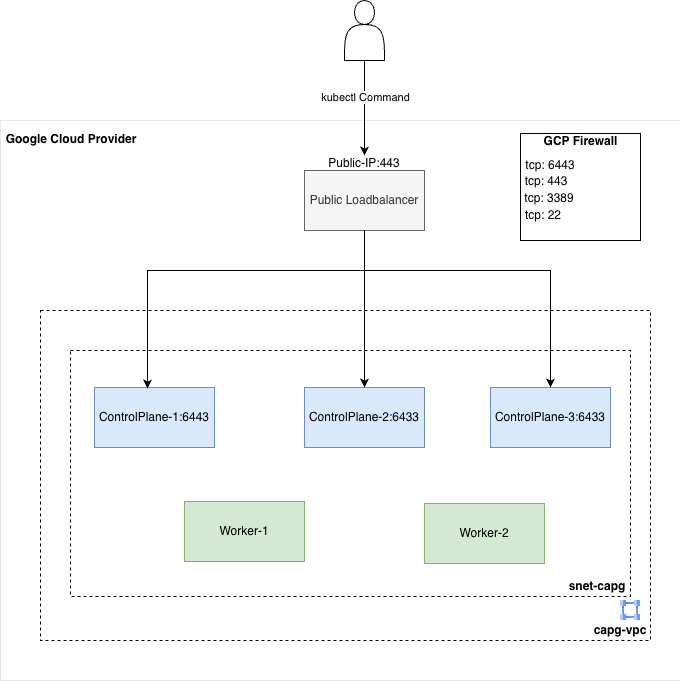
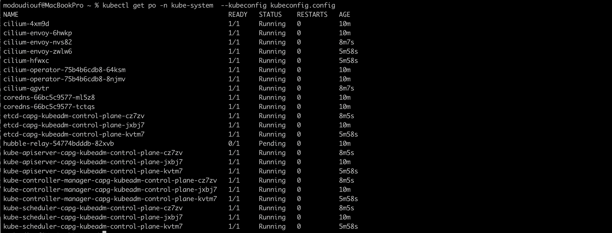
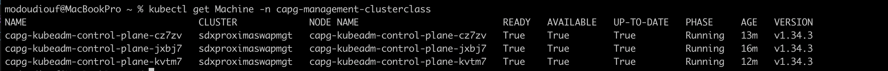

### Cluster API Architecture


### Costume Kubernete Architecture


### Step 1: GCP Configuration
#### On GCP Console
1. Create gcp project named capg
2. Enable Compute Engine API on your project "cagp" from gcp console
3. Create an service account for api authentication named gcp-credentials
4. Assigne roles below to the service account
    - Administrateur d'instance Compute (v1)
    - Utilisateur compte de service
    - compute.networks.create
    - compute.firewalls.create
5. Export credential as json file, gcp-credentials.json

#### Login gcloud
```
gcloud auth login
gloud projects list
gcloud config set project capg
```

#### Build OS images
```
export GCP_PROJECT_ID=capg-486910
export GOOGLE_APPLICATION_CREDENTIALS=/Users/modoudiouf/modou-projects/k8s-projects/capi/capg/gcp-credentials.json
git clone https://github.com/kubernetes-sigs/image-builder.git image-builder
cd image-builder/images/capi
make build-gce-ubuntu-2404
gcloud compute images list --project ${GCP_PROJECT_ID} --no-standard-images --filter="family:capi-ubuntu-2404-k8s"
export IMAGE_ID="projects/${GCP_PROJECT_ID}/global/images/cluster-api-ubuntu-2404-v1-34-3-1770640807"

```

#### Configured files in the image
1. Packages installed: 
    - socat, linux-tools-virtual
    - gnupg, ntp
    - chrony, apt-daily-upgrade.timer
    - libnetfilter-acct1, containerd
    - python3-pip, apt-daily.timer
    - kubelet, dockerd
    - jq, kubelet
    - libnetfilter-log1, conntrackd
    - apt-transport-https 
    - kubeadm
    - curl
    - conntrack
    - python3-netifaces
    - ebtables
    - libnetfilter-cttimeout1
2. ssh configuration
3. Machine type: n1-standard-1
4. Region us-central1-a
5. Network configuration
    - net.bridge.bridge-nf-call-iptables = 1
    - net.bridge.bridge-nf-call-ip6tables = 1
    - net.ipv4.ip_forward = 1
    - net.ipv6.conf.all.forwarding = 1
    - net.ipv6.conf.all.disable_ipv6 = 1
    - net.ipv4.tcp_congestion_control = 1
6. Kernel configuration
    - vm.overcommit_memory = 1
    - kernel.panic_on_oops = 1
    - fs.inotify.max_user_instances = 8192
    - fs.inotify.max_user_watches = 524288
7. Install Containerd
8. Install runc
9. Install crictl
10. Install kubernetes manifest
11. Install kubeadm, kubelet, kubectl
### Step 2: Install management cluster (minikube, kind)
```
minikube start
kubectl get node
```
### Step 3: Install Cluster API Operator
1. Download helm releases
```
helm repo add capi-operator https://kubernetes-sigs.github.io/cluster-api-operator
helm repo add jetstack https://charts.jetstack.io --force-update
helm repo update
```
2. Create secret for API authentication
    - Export GCP Credentials as Env
    ```
    export CREDENTIALS_SECRET_NAME="gcp-credentials"
    export CREDENTIALS_SECRET_NAMESPACE="default"
    export GCP_B64ENCODED_CREDENTIALS=$( cat gcp-credentials.json | base64 | tr -d '\n' )
    ```
    - Create kubernetes secret
    ```
    kubectl create secret generic "${CREDENTIALS_SECRET_NAME}" --from-literal=GCP_B64ENCODED_CREDENTIALS="${GCP_B64ENCODED_CREDENTIALS}" --namespace "${CREDENTIALS_SECRET_NAMESPACE}"
    ```

3. Install cert manager
```
helm install cert-manager jetstack/cert-manager --namespace cert-manager --create-namespace --set installCRDs=true
```

4. Install cluster API Operator
```
cat <<EOF > values.yaml
core:
  cluster-api:
    manager:
      featureGates:
        ClusterTopology: true
bootstrap:
  kubeadm:
    manager:
      featureGates:
        ClusterTopology: true
controlPlane:
  kubeadm:
    manager:
      featureGates:
        ClusterTopology: true
infrastructure: 
  gcp: 
    enabled: true
    version: "v1.11.0"
    manager:
      featureGates:
        ClusterTopology: true
configSecret:
  name: gcp-credentials
  namespace: default
EOF
```

```
helm install capi-operator capi-operator/cluster-api-operator --create-namespace -n capi-operator-system  --wait --timeout 90s -f values.yaml
```
### Step 4: Deployement 
##### Deploy Cluster API resources
### Create namespace
```
kubectl create ns capg-management-clusterclass
```
### Create VPC Network
1. Deploy resources
```
kubectl apply -f GcpCluster.yaml
kubectl apply -f Cluster.yaml
```
2. Add Firewall rule to the created network to allow (SSH, RDP, HTTP, HTTPS, ICMP) inbound trafic
Create it from portal
```
gcloud compute firewall-rules create capg-allow-k8s \
    --action=ALLOW \
    --direction=INGRESS \
    --network=vpc-capg \
    --priority=1000 \
    --rules=tcp:3389,22,443,80,6443,10250,2379-2380 \
    --source-ranges=0.0.0.0/0 \
    --description="Allow SSH RDP from anywhere"
```
### Create Gcp Virtual Machine (Control Plane)
1. Deploy resource
```
kubectl apply -f GcpMachineTemplate-cp.yaml
```

3. Boostrap the control plan
```
kubectl apply -f KubeadmControlPlan.yaml
```

#### Test
1. Check node
```

```
2. Check pod system
```

```
3. Check CAPI Machine
```

```


##### Troubleshooting
### Cloud init
1. Check cloud init status
```
cloud-init status --long
```
2. Check cloud init logs
```
cat /var/log/cloud-init-output.log
grep kubeadm /var/log/cloud-init-output.log
```
3. Check the cloud init data store (ds)
```
cloud-init query -l
cloud-init query ds.meta_data
```
### Pre Kubeadm Commands file
1. Check the pre kubeadm script store
```
ls /var/lib/cloud/instance/scripts
```
### Check the system logs
```
cat /var/log/syslog
```

### Check the kubeadm config file store (use by kubeadm to bootstrap cluster , with kubeadm init)
```
cat /run/kubeadm/kubeadm/kubeadm.yaml
```

### Check kubelet file (only available when boostrap has successful)
```
ls /var/lib/kubelet
```
### Check kubernetes manifests files (only available when boostrap has successful)
```
ls /etc/kubernetes/manifests
```
### Check Pod static when kubernetes is not reachable (on of the control plan component)
1. Check the cloud-init log (component responsible to execute bootstrap kubeadm config)
```
cat /var/log/cloud-init-output.log
```
2. Check pod static state and logs
```
crictl --runtime-endpoint unix:///var/run/containerd/containerd.sock ps -a | grep kube | grep -v pause
sudo crictl --runtime-endpoint unix:///var/run/containerd/containerd.sock logs <CONTAINER-ID> 
```
